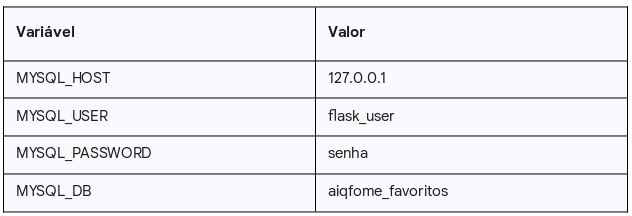
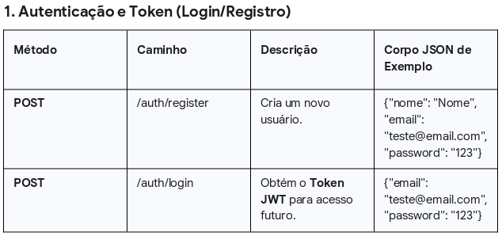
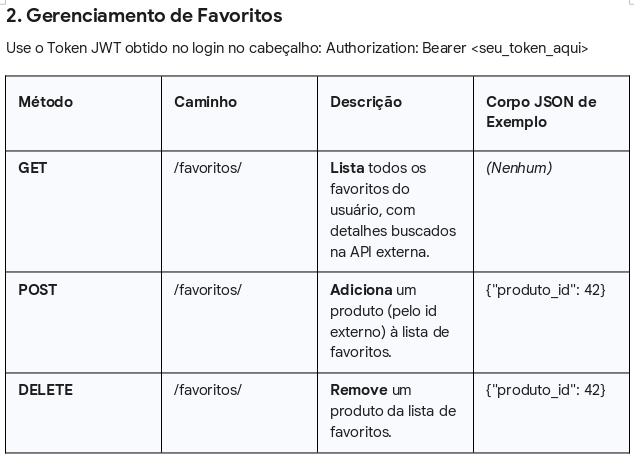
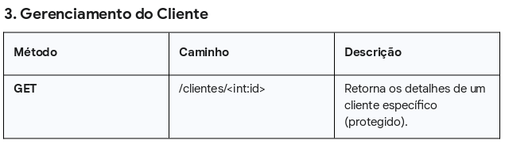

# API de Favoritos AiqFome
Este projeto é uma API RESTful desenvolvida em Flask que simula um sistema de favoritos para clientes. Ele permite a autenticação de usuários, armazena seus produtos favoritos em um banco de dados MySQL/MariaDB e busca detalhes desses produtos em uma API externa (Fake Store API).
### Instalação e Configuração
Siga os passos abaixo para configurar e rodar a aplicação localmente.

Você precisará ter instalado:
```
    • Python 3.x
    • MySQL ou MariaDB Server
    • Insomnia ou Postman para testes de API
```
1. Clonar e Configurar o Ambiente
### Clone o repositório 
git clone https://github.com/lucasnparreira/api_aiqfome 
cd api_aiqfome

### Cria e ativa o ambiente virtual (recomendado)
```
python3 -m venv venv
source venv/bin/activate  # No Windows: venv\Scripts\activate
```

2. Instalar Dependências Python
Instale todas as bibliotecas necessárias usando o requirements.txt:
```
pip install -r requirements.txt
```

3. Configurar o Banco de Dados (MySQL/MariaDB)
Esta API usa o banco de dados aiqfome_favoritos.
A. Criar o Banco de Dados e Usuário
Acesse o seu terminal MySQL/MariaDB (você pode usar sudo mysql -u root -p se tiver senha):
-- Garante que o usuário para o Flask exista (conforme configurado em config.py)
```
CREATE USER IF NOT EXISTS 'flask_user'@'127.0.0.1' IDENTIFIED BY 'senha'; 
CREATE DATABASE IF NOT EXISTS aiqfome_favoritos CHARACTER SET utf8mb4 COLLATE utf8mb4_unicode_ci;
GRANT ALL PRIVILEGES ON aiqfome_favoritos.* TO 'flask_user'@'127.0.0.1';
FLUSH PRIVILEGES;
```
```
USE aiqfome_favoritos;
```
```
-- Cria a tabela de Clientes
CREATE TABLE clientes (
    id INT AUTO_INCREMENT PRIMARY KEY,
    nome VARCHAR(100) NOT NULL,
    email VARCHAR(100) NOT NULL UNIQUE,
    senha VARCHAR(255) NOT NULL,
    data_cadastro TIMESTAMP DEFAULT CURRENT_TIMESTAMP
);

-- Cria a tabela de Favoritos
CREATE TABLE favoritos (
    cliente_id INT NOT NULL,
    produto_id INT NOT NULL,
    FOREIGN KEY (cliente_id) REFERENCES clientes(id)
        ON DELETE CASCADE,
    PRIMARY KEY (cliente_id, produto_id)
);
```

Caso esteja utilizando Windows, ou possua o mysql workbench instalado, pode realizar a configuracao de forma grafica/visual pelo proprio gerenciador ao inves de usar o terminal/prompt do Windows.


B. Verificar Credenciais
Confirme que seu arquivo config.py está com as credenciais corretas:



4. Rodar a Aplicação
python app.py

A API estará acessível em http://127.0.0.1:5000/.
### Como Usar a API
Todos os endpoints protegidos exigem um Token JWT no cabeçalho Authorization (Auth).







Qualquer duvida adicional, por favor entre em contato pelo e-mail lnparreira83@gmail.com - sera um prazer poder ajudar e compartilhar mais detalhes sobre a API. :)
